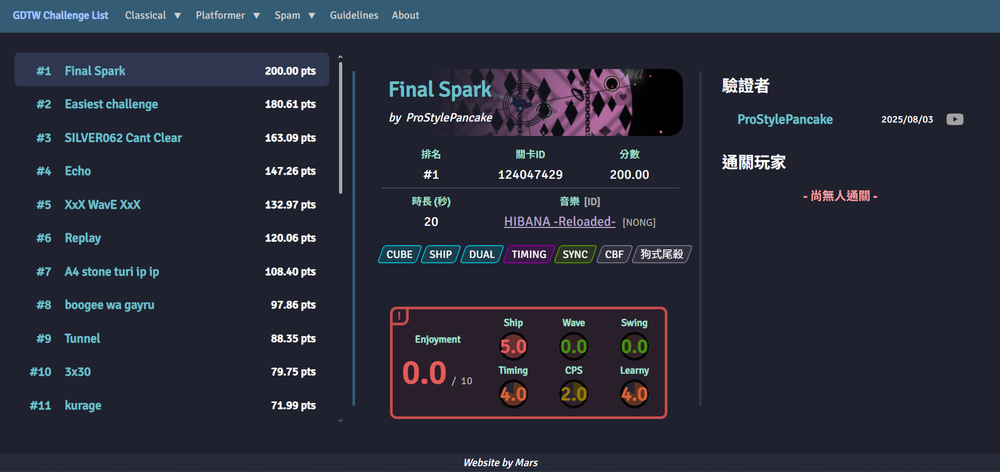

# GDTW Challenge List

This is a website that is made for the purpose of documenting the hardest "**Challenges** (short length level)" the members in the group "**GDTW** (Geometry Dash Taiwan)" created.

The website mainly consists of 2 lists:
- **Level List**: Levels the members have completed. Ordered by difficulty.
- **Leaderboard**: Members that have beaten any challenges. Ordered by points.

For all list challenges, several **tags** can be seen to indicate basic information about the level, and a **skillset/enjoyment metrics** that is calculated from the opinions of the challenge victors.

## Screenshots
  
***Level List***
 

  
***Leaderboard***
